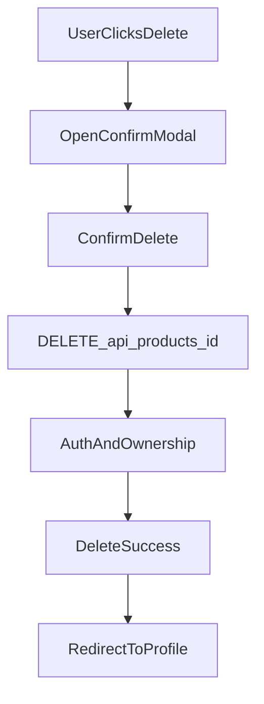

# Implement Product Edit/Delete

## Scope

- Add backend update/delete endpoints with ownership checks.
- Add frontend edit page using existing create form logic and populate fields from product data.
- Replace disabled owner actions with working Edit/Delete actions and a custom confirmation modal.
- Redirect to `/profile` after successful delete with a success message.
- Add Playwright e2e tests for edit, delete, and non-owner access control.

## Key Files

- Backend routes: [backend/src/routes/product.routes.ts](backend/src/routes/product.routes.ts)
- Product model: [backend/src/models/Product.ts](backend/src/models/Product.ts)
- Frontend routes: [frontend/src/main.tsx](frontend/src/main.tsx)
- Product details page: [frontend/src/pages/ProductDetails.tsx](frontend/src/pages/ProductDetails.tsx)
- Create product form: [frontend/src/pages/CreateProduct.tsx](frontend/src/pages/CreateProduct.tsx)
- Product services: [frontend/src/services/products.ts](frontend/src/services/products.ts)
- New edit page + modal styles: [frontend/src/pages/EditProduct.tsx](frontend/src/pages/EditProduct.tsx), [frontend/src/pages/edit-product.css](frontend/src/pages/edit-product.css) or reuse existing page CSS
- E2E specs: [e2e/](e2e/)

## Plan

1. **Backend API**
  - Add `PUT /api/products/:id` and `DELETE /api/products/:id` to `product.routes.ts`.
  - Apply `authenticate` + `requireVerified` and validate `:id` param.
  - Check product ownership (`product.sellerId === req.user.id`) before update/delete.
  - Update only allowed fields (title, description, price, category, images) and return updated product.
2. **Frontend services**
  - Add `updateProduct(id, payload)` and `deleteProduct(id)` in `products.ts`.
  - Reuse `http` helper and follow existing DTOs.
3. **Edit product page**
  - Create `EditProduct.tsx` using `CreateProduct` form structure.
  - Load product via `getProductById` and prefill fields (including category/images).
  - Submit updates via `updateProduct`, handle errors, and route back to details on success.
  - Add route `/products/:id/edit` in `main.tsx`.
4. **Owner actions + delete modal**
  - In `ProductDetails.tsx`, enable Edit button (navigate to edit page).
  - Add Delete button to open custom confirmation modal.
  - On confirm, call `deleteProduct`, then redirect to `/profile` with success state/flash message.
  - Implement modal markup + CSS (BEM, rem units, no nested selectors) following existing styling rules.
5. **Validation & polish**
  - Ensure only authors see actions and API enforces ownership.
  - Add basic loading/disabled states for edit/delete actions.
  - Check lints for edited files.
6. **E2E tests**
  - Add Playwright specs for owner edit flow and delete flow (modal confirm).
  - Add Playwright spec for non-owner not seeing edit/delete actions.
  - Reuse existing test utils to create verified users and reset DB.

## Diagram (Flow)

