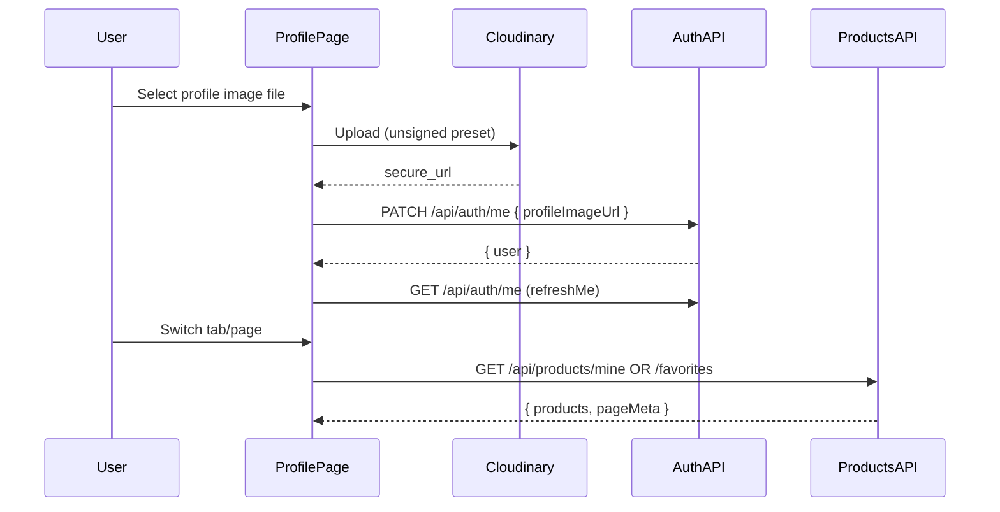

## Goal

Add a complete, authenticated Profile experience:

- Profile header: email, username, verification status, **profile photo** (placeholder when missing)
- Allow user to **upload** a profile photo (direct Cloudinary upload like Create Product)
- Tabs:
  - **My products**: products where `sellerId === me`
  - **My favorites**: products where `likedUsers` contains me

## Existing building blocks to reuse

- **Profile route is already mounted & protected**: `[frontend/src/main.tsx](frontend/src/main.tsx)` (route `profile` under `ProtectedRoute`)
- **Auth user already has** `profileImageUrl`: `[frontend/src/contexts/AuthContext.tsx](frontend/src/contexts/AuthContext.tsx)`
- **Cloudinary direct upload pattern exists**: `[frontend/src/pages/CreateProduct.tsx](frontend/src/pages/CreateProduct.tsx)` (`uploadToCloudinary`)
- **Product grid + pagination UI**: `[frontend/src/pages/AllProducts.tsx](frontend/src/pages/AllProducts.tsx)` + `[frontend/src/pages/all-products.css](frontend/src/pages/all-products.css)`
- Backend data model support:
  - `User.profileImageUrl`: `[backend/src/models/User.ts](backend/src/models/User.ts)`
  - `Product.sellerId`, `Product.likedUsers`: `[backend/src/models/Product.ts](backend/src/models/Product.ts)`

## Backend changes

### 1) Update profile image URL

- **Add** `PATCH /api/auth/me` in `[backend/src/routes/auth.routes.ts](backend/src/routes/auth.routes.ts)`
  - Middleware: `authenticate`
  - Validation: `profileImageUrl` is `string` (max 2048) or `null`
  - Behavior: update current user’s `profileImageUrl` and return `{ user: toPublicUser(user) }`

### 2) Add “my products” and “my favorites” list endpoints (paginated)

- **Add** to `[backend/src/routes/product.routes.ts](backend/src/routes/product.routes.ts)` (IMPORTANT: place before `GET /:id`):
  - `GET /api/products/mine?page&limit`
    - Middleware: `authenticate`
    - Query filter: `{ sellerId: req.user!.id }`
  - `GET /api/products/favorites?page&limit`
    - Middleware: `authenticate`
    - Query filter: `{ likedUsers: req.user!.id }`
  - Response shape: match existing `GET /api/products` response:
    - `{ products, page, limit, total, totalPages }`
  - Reuse the same mapping/population logic as the existing list route (category populate + mapping to `{ id, sellerId, title, ... }`).

### 3) (Optional but recommended) indexes for new queries

- In `[backend/src/models/Product.ts](backend/src/models/Product.ts)`, add indexes:
  - `productSchema.index({ sellerId: 1, publishedAt: -1 })`
  - `productSchema.index({ likedUsers: 1, publishedAt: -1 })`

## Frontend changes

### 1) Upgrade Profile page UI

- Update `[frontend/src/pages/Profile.tsx](frontend/src/pages/Profile.tsx)` to include:
  - **Avatar block**:
    - If `user.profileImageUrl` -> render ``
    - Else render placeholder (circle with initials from `username` or email)
  - **Upload control**:
    - `<input type="file" accept="image/*">`
    - On select: upload to Cloudinary (reuse/inline the `uploadToCloudinary` approach from `CreateProduct.tsx`)
    - After upload: call backend `PATCH /api/auth/me` with the new URL
    - Finally call `refreshMe()` so `AuthContext.user` updates everywhere

### 2) Tabs + paginated lists

- Implement tabs inside `Profile.tsx` driven by query params for shareable state:
  - `?tab=products|favorites&page=1`
- When `tab/page` changes:
  - Fetch correct data set and show the **same grid + pagination** patterns as `AllProducts.tsx`.
- Empty states:
  - My products: “No products yet” (link to create product if verified)
  - My favorites: “No favorites yet” (and if not verified, hint that verification is required to favorite)

### 3) Services

- Extend `[frontend/src/services/products.ts](frontend/src/services/products.ts)` with:
  - `getMyProducts({ page, limit })`
  - `getMyFavorites({ page, limit })`
  returning the same `ProductsListResponse` shape used by `AllProducts`.

### 4) Styling

- Add a new stylesheet `[frontend/src/pages/profile.css](frontend/src/pages/profile.css)` using BEM + rem units:
  - `.profile__header`, `.profile__avatar`, `.profile__tabs`, `.profile__tab`, `.profile__tab--active`, `.profile__panel`
- Reuse existing grid CSS by applying `.all-products__grid` / `.product-item` markup in Profile, or (optional refactor) extract a shared `ProductGrid` component.

## Data flow (high level)

## Test plan

- **Manual**:
  - Upload profile photo; reload; photo persists; placeholder shows when none.
  - Switch tabs; pagination works; clicking product card navigates to details.
  - Favorites tab shows favorited items after favoriting from Product Details.
  - Unverified user: can access profile; sees appropriate hints.
- **Automated (optional)**:
  - Add backend route tests for new endpoints if a test harness exists; otherwise keep manual.

