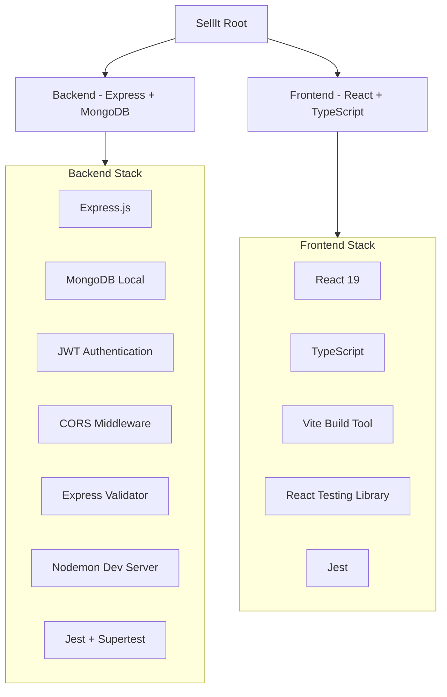

# SellIt Project Environment Setup

## Architecture Overview




## Project Structure

The monorepo will be organized as follows:

```
sellit-cursor/
├── backend/
│   ├── src/
│   │   ├── config/
│   │   ├── controllers/
│   │   ├── middleware/
│   │   ├── models/
│   │   ├── routes/
│   │   └── server.ts
│   ├── tests/
│   ├── package.json
│   └── tsconfig.json
├── frontend/
│   ├── src/
│   │   ├── components/
│   │   ├── pages/
│   │   ├── services/
│   │   ├── App.tsx
│   │   └── main.tsx
│   ├── public/
│   ├── tests/
│   ├── package.json
│   ├── tsconfig.json
│   └── vite.config.ts
├── package.json (root workspace manager)
└── README.md
```

## Backend Setup Details

### Dependencies to Install

**Production Dependencies:**

- `express` - Web framework
- `mongoose` - MongoDB ODM
- `jsonwebtoken` - JWT authentication
- `bcryptjs` - Password hashing
- `cors` - Cross-origin resource sharing
- `express-validator` - Request validation
- `dotenv` - Environment variables
- `helmet` - Security headers

**Development Dependencies:**

- `typescript` - TypeScript support
- `@types/express`, `@types/node`, `@types/jsonwebtoken`, `@types/bcryptjs`, `@types/cors`
- `nodemon` - Auto-restart server
- `ts-node` - TypeScript execution
- `jest` - Testing framework
- `@types/jest` - Jest types
- `supertest` - HTTP assertions
- `@types/supertest` - Supertest types
- `mongodb-memory-server` - In-memory MongoDB for testing

### Core Backend Files

**[backend/src/server.ts](backend/src/server.ts)** - Main Express server with middleware setup
**[backend/src/config/database.ts](backend/src/config/database.ts)** - MongoDB connection configuration
**[backend/.env.example](backend/.env.example)** - Environment variables template

## Frontend Setup Details

### Dependencies to Install

**Production Dependencies:**

- `react` - UI library
- `react-dom` - React DOM rendering
- `react-router-dom` - Routing
- `axios` - HTTP client

**Development Dependencies:**

- `@vitejs/plugin-react` - Vite React plugin
- `typescript` - TypeScript support
- `vite` - Build tool
- `@types/react`, `@types/react-dom` - React types
- `jest` - Testing framework
- `@testing-library/react` - React testing utilities
- `@testing-library/jest-dom` - Jest DOM matchers
- `@testing-library/user-event` - User interaction simulation
- `jest-environment-jsdom` - JSDOM environment

### Core Frontend Files

**[frontend/src/App.tsx](frontend/src/App.tsx)** - Main React component
**[frontend/src/main.tsx](frontend/src/main.tsx)** - React entry point
**[frontend/vite.config.ts](frontend/vite.config.ts)** - Vite configuration
**[frontend/jest.config.js](frontend/jest.config.js)** - Jest configuration

## Testing Strategy

### Backend Tests

- Unit tests for models, controllers, and middleware
- Integration tests for API endpoints using Supertest
- MongoDB Memory Server for isolated database testing

### Frontend Tests

- Component tests with React Testing Library
- User interaction tests with user-event
- Jest for test runner and assertions

## Verification Steps

The setup will include verification for:

1. **Backend Verification:**
  - TypeScript compilation succeeds
  - MongoDB connection establishes successfully
  - Express server starts on port 5000
  - Health check endpoint responds correctly
  - Sample tests pass
2. **Frontend Verification:**
  - TypeScript compilation succeeds
  - Vite dev server starts on port 5173
  - React app renders without errors
  - Sample component test passes
3. **Integration Verification:**
  - Frontend can communicate with backend API
  - CORS is properly configured
  - Environment variables load correctly

## Implementation Approach

The tech-lead agent will coordinate the setup by:

1. Creating the monorepo root structure with workspace configuration
2. Delegating backend setup to backend-expert agent
3. Delegating frontend setup to react-expert agent
4. Running comprehensive verification tests
5. Creating documentation for running the project

Each component will be verified independently before final integration testing.